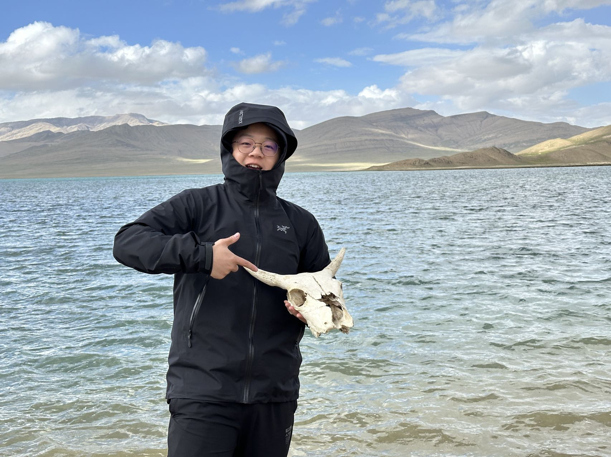
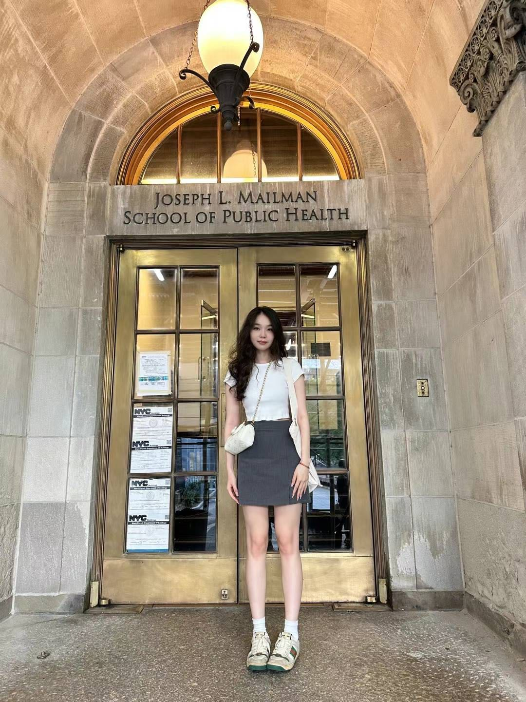

# Welcome to connect us!

## Zitao Zhang

As a biostatistics graduate student at Columbia University with a strong foundation in data science, I bring experience in clinical trial analysis, machine learning, and business analytics. I have a proven track record in leveraging statistical models to solve complex problems, with hands-on experience in R, Python, and Tableau. Previously, I've contributed to projects ranging from clinical trial efficacy to gaming market analytics. I'm passionate about applying data-driven insights to real-world challenges and continuously seeking opportunities to expand my expertise in biostatistics and data analysis.

[Linkedin](https://www.linkedin.com/in/zitao-zhang-b69274228/)

## Jiayi Ge

My name is Jiayi, a graduate student in Biostatistics at Columbia University with a daul Bachelor’s degrees in Economics and Food System, Nutrition and Health from the University of Washington.

[Linkedin](https://www.linkedin.com/in/jiayi-ge-866a79299/)

## Yi Su

Hello everyone! I am Yi Su, a graduate student in Biostatistics with a Bachelor’s degree in Statistics from the University of Washington, Seattle. I am passionate about data and health research. Outside of school, I love traveling to new places, reading, and hiking. I am a cat lover and enjoy spending time with these amazing, playful companions. Welcome to my page!

[Linkedin](https://www.linkedin.com/in/yi-su-01bb47273/)
